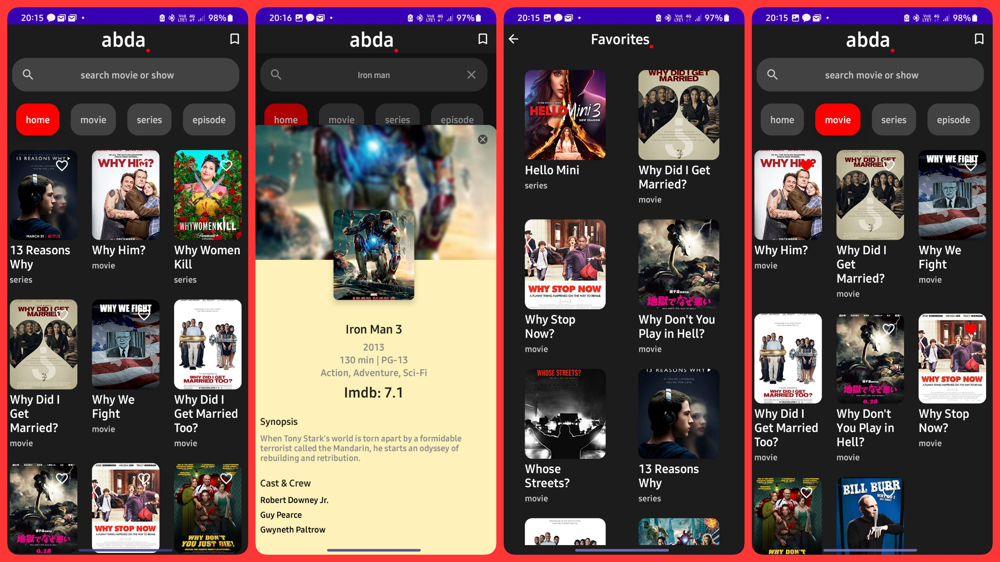

# adba

<b> Proposed application : </b>
A light and interactive Android Application that shows movie/series details and its related data using a Omdb API. 

<b> Concepts & Functionality used : </b>
The enitre app is created using kotlin and Android's newly launched Jetpack Compose.
It follow clean architecture MVVM pattern.

Features include:
 - Fetching movie data from remote data source
 - Bookmark your favorite selection and store them in a local storage.
 - Network error handling (no netowrk / Loading / error)
 - Local caching
 - Tools used: Retrofit, Kotlin coroutines, Flow, Live data, Hilt (dependency injection), Glide, Room Database, Jetpack Compose components

Check the app: <a href="https://drive.google.com/file/d/1b_1B3L1nu19xc9H8nWXD3sWeD_H3Geel/view?usp=sharing">Application download link</a>.
